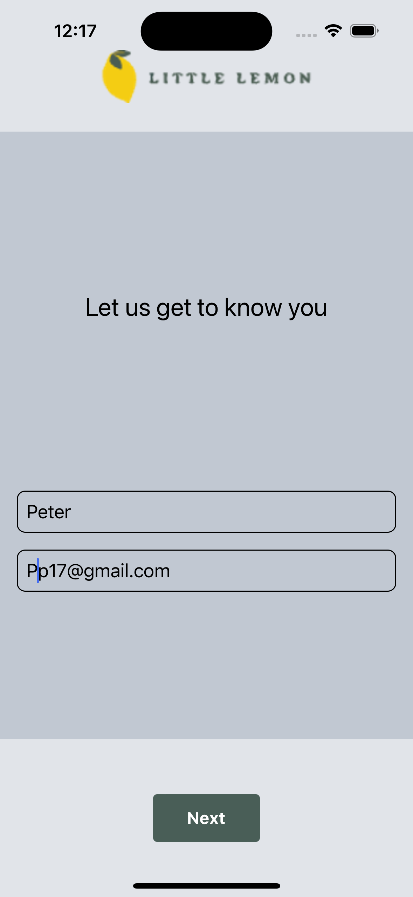
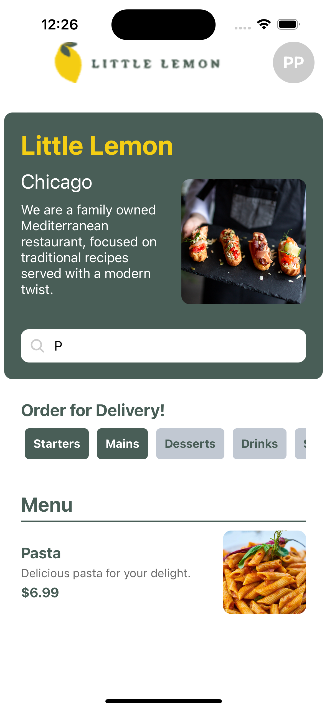
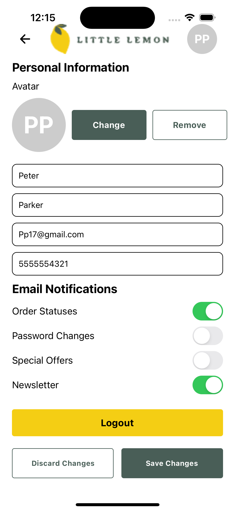

# Little Lemon Restaurant App

## Description
A React Native app for the Little Lemon Restaurant that allows users to browse the menu, search for items, and filter by categories. The app fetches data from an online API and stores it locally using SQLite.

## Table of Contents
- [Installation](#installation)
- [Usage](#usage)
- [Screenshots](#screenshots)
- [Architecture](#architecture)
- [Features](#features)
- [Development](#development)
- [Contributing](#contributing)
- [Credits](#credits)
- [License](#license)

## Installation

### Prerequisites
- Node.js
- Expo CLI
- SQLite (included with Expo)

### Steps
1. Clone the repository:
    ```bash
    git clone https://github.com/terzidest/little-lemon.git
    cd little-lemon
    ```
2. Install dependencies:
    ```bash
    npm install
    ```
3. Start the development server:
    ```bash
    npx expo start
    ```

## Usage
1. Run the app on an emulator or physical device using the Expo Go app.
2. Browse the menu, search for items, and filter by categories.

## Screenshots

### Onboarding Screen
<table><tr><td>

</td></tr></table>

### Home Screen
<table><tr><td>

</td></tr></table>

### Filter and Search
<table><tr><td>

</td></tr></table>

### Profile Screen
<table><tr><td>

</td></tr></table>

## Architecture

### Folder Structure
- `assets/`: Images and fonts.
- `components/`: Reusable components.
- `screens/`: Screen components.
- `database.js`: SQLite database setup and functions.
- `App.js`: Entry point of the app.

### Technologies Used
- React Native
- Expo
- SQLite
- Axios

## Features
- Browse menu items with images and descriptions.
- Search for items by name.
- Filter items by categories (Starters, Mains, Desserts, Drinks, Specials).
- View detailed information about each menu item.

## Development

### API Integration
The app fetches menu data from the [Little Lemon API](https://raw.githubusercontent.com/Meta-Mobile-Developer-PC/Working-With-Data-API/main/capstone.json) and stores it locally using SQLite.

### Database
SQLite is used to store menu data locally for offline access. The `database.js` file contains functions to manage the local database.

### State Management
The app uses the Context API to manage global state, such as selected categories and search terms.

## Contributing
1. Fork the repository.
2. Create a new branch (`git checkout -b feature-branch`).
3. Commit your changes (`git commit -am 'Add new feature'`).
4. Push to the branch (`git push origin feature-branch`).
5. Create a new Pull Request.

## Credits
- [Expo](https://expo.dev/)
- [React Native](https://reactnative.dev/)
- [SQLite](https://www.sqlite.org/index.html)

## License
This project is licensed under the MIT License.
